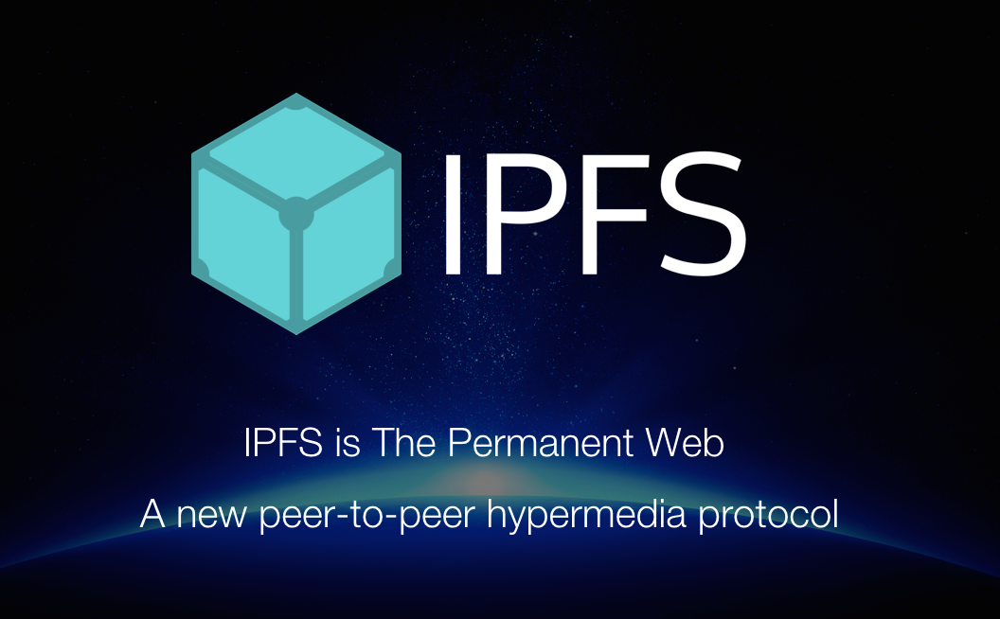

# IPFS Specs

This repository contains the specs for the IPFS Protocol and associated
subsystems. Some day we will hopefully transform these specs into RFCs.
For now, they assume a high level of familiarity with the concepts.

## Work In Progress

Warning: this is a work in progress. IPFS is a young system and we want to
get it right. We will continue to evaluate and re-think pieces. At this point,
the IPFS protocol is solid enough to write this spec and produce interoperable
implementations in different languages.

**(This is not done yet, but)**
I will tag different specs with their stability:

- `wip` this spec is a work-in-progress, it is likely not even complete.
- `draft` this spec is a rough draft and will likely change substantially.
- `stable` this spec is likely to improve, but not change fundamentally.
- `reliable` this spec is believed to be close to final. minor changes only.
- `permanent` this spec will not change

Nothing in this spec repository is `permanent` yet. The most important
pieces of IPFS are now `solid` or `stable`. Many subsystems remain as
`draft`.

## Specs

The specs contained in this repository are:

Protocol:
- [protocol](protocol) - the top-level spec and the stack

Stack:
- network - the network layer spec
- routing - the routing layer spec
- exchange - the exchange layer spec
- merkledag - the merkledag layer spec
- ipns - the naming layer spec
- app - the application layer spec

Routing Systems:
- kademlia - kademlia dht
- dnssd - mdns for local area networks
- snr - supernode delegated routing
- multirouter - combines multiple others

Exchanges:
- bitswap - bittorrent inspired exchange

Service:
- service - the spec ipfs libraries and servers should implement
- service-http-api - the http api version of ipfs-service
- service-cli - the cli version of ipfs-service

Repository:
- [repo](repo) - ipfs node local repository spec
- config - ipfs node configuration
- fs-repo - the spec of the fs-repo implementation

Other protocols:
- id - node identification
- relay - the relay protocol

Formats:
- [multihash](https://github.com/jbenet/multihash) - self-describing hash digest format
- [multiaddr](https://github.com/jbenet/multiaddr) - self-describing addressing format

## Collaborating

Suggestions, contributions, criticisms are welcome. Though please make sure to
familiarize yourself deeply with IPFS, the models it adopts, and the principles
it follows.

Please be aware that specs are really hard to design by committee.
Treat this space like you would the workshop of an artist. Please suggest
improvements, but please don't be disappointed if we say no to something.
What we leave out is often more important than what we add in.
